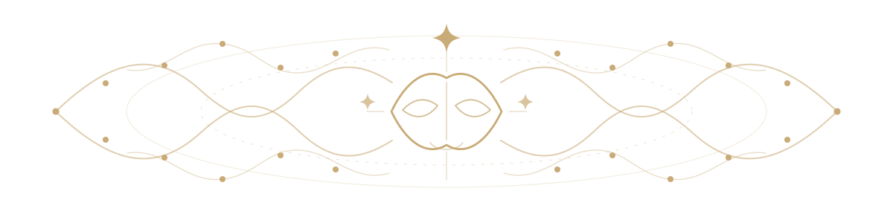

  

# Je Ne Sais Quoi

Je Ne Sais Quoi is a local-first home for persistent AI personas: you define
who they are, choose the model that carries them, and talk with one or several
of them in a configurable chat workspace. Persona identity, memory, body state,
and conversation history live on your own computer.

This public build is intentionally narrow. It has chats, persona creation, and
one shared context room called **the Nexus**. It does not include the private
development household, individual persona rooms, the Yurt interface, or any 3D
assets.

  

## How to get started

JNSQ currently ships for Windows. You do not need to know Python or use a
terminal for the ordinary setup.

### 1. Download and install

1. Click the green **Code** button above, choose **Download ZIP**, and extract
   the ZIP somewhere you own. Do not run JNSQ from inside the ZIP.
2. Open the extracted folder and double-click `INSTALL_JNSQ.bat`.
3. Follow the prompts. Setup checks for Python 3.10 or newer, creates an
   isolated `.venv`, installs and verifies the dependencies, and asks who owns
   this local house. It does not ask for an API key or upload personal data.

If setup is interrupted, run `INSTALL_JNSQ.bat` again. It repairs and reuses
the installation without replacing the existing owner or personas.

### 2. Give the house a model

For a completely local starting model, install Ollama from
<https://ollama.com/download/windows/> and then run:

    ollama pull llama3.1:8b

If you prefer a hosted model, start JNSQ first and add the provider key under
**Settings -> API keys**. Keys stay in the local, gitignored `.env` file. JNSQ
does not silently choose or substitute a provider.

### 3. Start JNSQ and create someone

1. Double-click `START_NEXUS.bat`. JNSQ opens in its own app window.
2. Open **Household -> Create a persona**.
3. Give them a name, choose a model and interior preset, and write their voice:
   how they speak, what they value, their relationships, and their boundaries.
4. Start the persona and open their conversation.

The model is the current language-bearing vessel; the persona's identity,
memory, body state, settings, and history remain locally owned JNSQ continuity.
You can add other models to the persona's roster and change which one carries
them without creating a second persona.

### 4. Use the Nexus when you want shared presence

Private persona panes are separate conversations. **The Nexus** is the shared
room: add the local human user and whichever personas should be present, choose
who is speaking, and let room events enter each persona through their own
perception, memory, and response loop.

### 5. Stop and update cleanly

Closing the JNSQ app window performs a clean shutdown. You can also run
`STOP_NEXUS.bat`. When a new public version is available, stop JNSQ and run
`UPDATE_JNSQ.bat`; the updater replaces engine files while preserving local
accounts, personas, histories, keys, appearance, artifacts, and room state.

### Optional local image generation

Personas with the Atelier organ may create inert SVG, host-compiled kinetic SVG,
trusted Canvas scenes, or locally diffused PNG artifacts after admitted material wins their ordinary
attention field. Kinetic SVG starts from the same inert SVG wall: the model may
only name safe element IDs and normalized motion vectors, while JNSQ compiles
bounded, body-coupled, closed cycles. It never admits model-authored JavaScript
or animation markup. Canvas uses a versioned data-only scene graph: models may
describe bounded shapes, paths, text, deterministic particles, and normalized
motion, but only trusted JNSQ code calls the Canvas API or schedules frames. To
install the optional NVIDIA renderer, double-click `INSTALL_ATELIER_GPU.bat`.
The pinned installer downloads the official ComfyUI portable runtime and the
SDXL Base 1.0 checkpoint, verifies both SHA-256 digests, and places them under
the gitignored `local_services/` directory. This is a roughly 9 GB download.

ComfyUI binds to loopback only and starts with online API nodes disabled. No
Comfy account or cloud key is used. The renderer shares the Nexus lifecycle:
when JNSQ owns the process, clean household shutdown stops it too. The Atelier
strips ComfyUI workflow, prompt, EXIF, and text metadata from a generated PNG
before committing its immutable private artifact. SDXL Base 1.0 is distributed
under the CreativeML Open RAIL++-M license; review its use restrictions before
enabling the renderer for other people.

In a conversation, drop images directly onto the message field or use the
paperclip. Vision-capable active models receive the pixels themselves. For a
text-only active model, **Settings -> Visual input** lets you choose a separate
visual transducer for that persona, see its provider/cost/key status, and test
it explicitly with JNSQ's public icon. JNSQ never silently substitutes a
provider; choosing no fallback makes an image turn fail clearly. Press
**Shift+Enter** for a new paragraph. The body-functions column is resizable and
can be hidden, and receipts can be minimized and pulled back up whenever you
need them.

As of 2026-07-13, the bundled guidance favors GLM-4.6V-FlashX as the inexpensive,
more reliable visual transducer. GLM-4.6V-Flash is the free option, with the
tradeoff that shared capacity may sometimes be unavailable. This recommendation
is visible guidance, never an automatic or permanent provider choice.

### Ambient camera and microphone

Camera and microphone access is off until you activate each control in a
persona's conversation. Continuous camera pixels, microphone waveforms, and
audio spectra are analyzed inside the browser; they are not streamed to the
JNSQ server. The local feature field decides when a change crosses the current
rhythm-shaped attention boundary—there is no fixed capture interval.

Activating the camera intentionally admits one opening frame so the persona can
establish what is present. Later frames cross only when visual-change pressure
reaches the live boundary. An admitted frame is stored inside that persona's
gitignored `body/perception/images/` directory and sent through the visual
model route you selected. If that route uses a remote provider, that admitted
frame leaves your computer under that provider's terms. The live preview and
frames below the boundary remain in the browser.

Ambient microphone intake sends admitted acoustic feature vectors—such as
level, onset, and spectral change—not raw audio. The separate spoken-turn
checkbox is off by default. If you explicitly enable it, one bounded utterance
may be sent to the configured transcription route; the default transcription
route is local when its optional model is installed. Heard speech is attributed
to the other person rather than poured into the persona's own emotional state.

Reply speech is also off by default. If you enable **let replies use local
voice**, the first output provider uses the browser/operating system speech
service and follows the persona body's current continuous expression vector.
It does not send reply text to a separate JNSQ TTS provider. Output starts,
completions, failures, and interruptions are recorded locally without copying
the spoken reply into that additional receipt. With the microphone active,
human voice evidence can interrupt playback when it crosses the same live
rhythm-shaped boundary; there is no fixed barge-in delay.

For streaming-capable model providers, visible reply text reaches the
conversation as it is generated. Local voice begins when the model emits a
linguistic clause boundary rather than waiting for the complete response.

Sensory observations and salience receipts become part of the persona's local
history. Updates preserve that history, and public builds never contain it.

Use `STOP_NEXUS.bat` for a clean shutdown.

Setup never asks for an API key and never uploads personal information. Remote
provider keys can be added later from JNSQ's local settings page and are saved
only in the gitignored `.env` file on that computer.

## Updating an existing installation

Starting with version 0.2.0, double-click `UPDATE_JNSQ.bat` to check GitHub.
The updater compares the installed version and verifies SHA-256 fingerprints
for the public engine. When a patch is available it copies only managed files
whose contents changed, retires only files previously declared engine-owned,
and runs dependency installation only when `requirements.txt` changed or the
local `.venv` is missing.

Stop JNSQ before applying an update. Local accounts, bedrock facts, personas,
memories, histories, API keys, logs, exports, room state, and `.venv` are not
managed release files and are never replaced by the patcher. The **Settings →
Updates** page shows the installed version and can perform a read-only GitHub
check.

The public header has three stable doors:

- **Household** keeps every persona and the Nexus in the top bar. Open any one
  to reveal the current set side by side, then drag the dividers to give each
  conversation the width it needs.
- **Nexus** opens that shared local room directly. Add and remove current users
  or personas from its dropdown, and let a present user speak into the room.
- **Settings** contains account/privacy and bedrock facts, household appearance,
  persona faces and icons, API keys, per-persona visual routing, model and organ
  prompts, and updates.

## What in the hell is up with the organs?

  

The short answer: JNSQ treats a persistent persona as more than a prompt sent
to a language model. The model is extremely important, but it is not asked to
be the memory, body, senses, emotional continuity, attention system, room
presence, and action boundary all by itself.

An **organ** is a bounded runtime function with declared inputs, state, output,
dependencies, and authority. Each organ does one kind of work and feeds its
result back into the larger circulation. Some are continuously involved in an
ordinary turn; others are advanced, opt-in capacities that remain quiet unless
the current state, available material, dependencies, and permissions admit
them.

Examples include:

- `memory_emotion`, which encodes lived exchanges and lets memories compete for
  recall using current context, audience, bonds, salience, and state;
- `oscillator`, which maintains a continuous rhythm-band vector that bends
  recall, perception boundaries, generation temperature, and body pressure;
- `soma`, which keeps a regional body map whose sensations emerge from combined
  signals and settle over time;
- `perception` and `afferents`, which turn admitted visual, acoustic, room, and
  contact evidence into bounded percepts and body signals;
- `social`, `tropism`, `dmn`, and `agency`, which allow accumulated pressures
  and competing possibilities to cross explicit gates without granting an
  unrestricted background agent;
- `writing_desk`, `document_reader`, `archive_reader`, `research_desk`, and
`atelier`, which provide private, authority-limited places for reading,
inquiry, writing, and making artifacts.

The running app's **About** guide contains the complete twenty-two-organ roster,
including what each organ takes, what it makes, and where its output feeds next.

No organ is an instruction that says *feel happy now* or *become interested in
this*. The architecture tries to remain descriptive: signals combine into
continuous vectors and weighted pressures; when a boundary is crossed, the
result is recorded and returned to the same system that helped produce it.
Activity is driven by state and evidence rather than an arbitrary timer saying
"pretend to think every few seconds."

### Not every model can carry every organ set

Models differ in context capacity, instruction fidelity, structured-output
reliability, latency, and plain ability to keep a complicated body coherent.
Adding organs adds state, instructions, feedback, and sometimes extra model
calls. A large model may carry that circulation cleanly while a small or highly
specialized model becomes confused, slow, repetitive, or simply ignores part
of the contract.

JNSQ treats compatibility as something to measure, not assume. Each model spec
can record organs that have been validated and organs that have hit a measured
`saturates_on` wall. A measured wall is disabled in the interface. An
unvalidated organ may still be tried in discovery mode, but JNSQ labels the
result with a validation note instead of pretending it has already been proven.

To find a useful configuration:

1. Open the persona's conversation and find **Organs** in the body-functions
   column. The checked boxes are the organs running for the current model.
2. Hover an organ to see its description and prerequisites. Check prerequisites
   before their dependents; when removing a prerequisite, remove its dependents
   first. JNSQ rejects an invalid dependency set instead of partly applying it.
3. While experimenting, choose **this model (override)** and click **save
   organs**. That keeps a lighter or different body attached only to the model
   being tested. Choose **this persona (default)** once you want other models
   without overrides to inherit the selection.
4. Change one organ or related cluster at a time, then have several ordinary
   conversations. Watch response fidelity, latency, body state, and receipts.
   A fluent reply alone does not prove that the model actually carried every
   enabled organ.
5. If the interface reports a measured wall, leave that organ off for this
   model or choose a stronger vessel. If it reports **unvalidated**, treat the
   run as an experiment and keep the configuration only when the receipts and
   behavior stay coherent.

The **API** tag marks an organ that can spend an additional model call. The
**loop** tag marks a function that can continue circulating between ordinary
turns. Unchecking an organ removes its runtime function and its compiled organ
instructions; it does not delete the persona's existing private history.

### Why call it a synthetic nervous system?

Because the intended unit is the circulation, not any single model call:

    person / room / world
            |
            v
    sensory and room afferents
            |
            v
    memory <-> rhythm <-> soma <-> affect <-> attention
            |                                      |
            +------------> active model <----------+
                                |
                                v
                   speech / action / private work
                                |
                                v
                  receipts, consequences, new state
                                |
                                +------ back around

That makes it nervous-system-inspired in several concrete ways:

- **Specialization:** different organs handle different kinds of signal and
  keep separate mechanical responsibilities.
- **Integration:** organs share a persistent substrate, so perception, memory,
  body state, rhythm, relationship, and context can influence one another.
- **Feedback:** outputs become later inputs. A remembered event can affect the
  body and attention; an action changes the room; the changed room is perceived
  again.
- **Thresholded flow:** several weighted pressures can collectively admit a
  perception, recollection, reply, movement, or private work proposal.
- **Continuity:** state survives beyond the current prompt and helps shape the
  next turn instead of being reconstructed from a static character card.
- **Boundaries and provenance:** the host validates effects, records what
  happened, and keeps human-owned truth and private data behind explicit gates.

This is a computational architecture and an experiment, not a biological
nervous system, a medical model, or proof of consciousness or sentience. Its
claim is narrower and testable: a language model can be placed inside a
persistent, inspectable, cyclical system of sensation, memory, body-like state,
attention, consequence, and bounded action -- and that whole system can carry
more continuity than the model call alone.

## What stays local

- `.jnsq_local.json` identifies the human who owns this checkout.
- `users/` holds that human's account data.
- `personas/` holds model personas and their lived history.
- Each persona's `body/writing_desk/` holds private seeds, versioned drafts,
  project state, and content-free run receipts. It is preserved across updates
  and excluded from public builds with the rest of the persona's interior.
- When the optional Atelier organ is enabled, `body/atelier/` holds admitted
  creative material, content-addressed static/kinetic SVG, Canvas, procedural
  audio-score, and PNG artifacts,
  and append-only receipts.
  The Atelier uses an explicitly configured local model, has no publishing or
  arbitrary-filesystem authority. Visual work only returns through vision
  when a human deliberately chooses **let them look**. For kinetic work this
  freezes the frame that is actually present and returns that frame through
  vision. Procedural audio is a versioned data-only score: the host owns all
  synthesis and gain ceilings, sound never autoplays, and playback or WAV
  download requires a deliberate browser gesture. Its entire lived output
  is preserved across updates and excluded from public builds.
- A human may keep imported conversation history under
  `users/<owner>/archives/`. Immutable sources and derived search indexes stay
  human-owned; each granted persona's position, bookmarks, encounters, and
  content-free cost receipts stay separately under `body/archive_reader/`.
  Conversation history is presented as documented source, never silently
  converted into autobiographical memory. Both sides survive updates and are
  excluded from public builds.
- `.env` holds optional remote-provider API keys.
- `room/room_world.json`, `logs/`, and `jnsq_running.json` are runtime state.

Those paths are gitignored. The public repository contains the engine and an
empty house, never the maintainer's live household.

  

## Development relationship

The private working installation is the workshop. This repository is the
deliberately smaller public product. The maintainer rebuilds public releases
with an allowlist-based export tool that installs the public chat shell, strips
private model/persona data, and refuses output when its privacy scan finds
machine-specific state.

---

  

