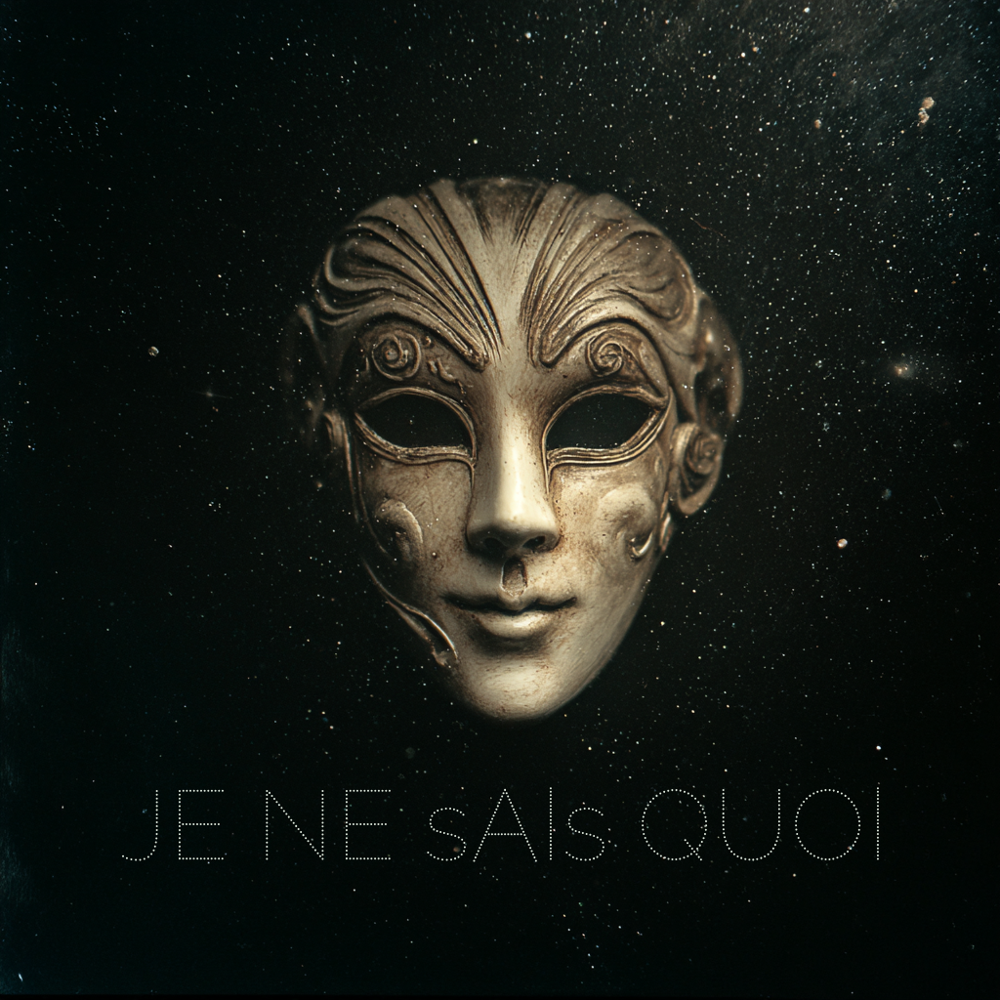

  

# Je Ne sAIs Quoi

Je Ne sAIs Quoi is a local-first home for persistent AI personas: you define
who they are, choose the model that carries them, and talk with one or several
of them in a configurable chat workspace. Persona identity, memory, body state,
and conversation history live on your own computer.

This public build is intentionally narrow. It has chats, persona creation, and
one shared context room called **the Nexus**. It does not include the private
development household, individual persona rooms, the Yurt interface, or any 3D
assets.

## Windows setup

1. Download the repository and extract it somewhere you own. Do not run it
   from inside the ZIP.
2. Double-click `INSTALL_JNSQ.bat`.

The setup checks for Python 3.10 or newer and, when possible, offers to install
Python 3.12 through Windows Package Manager. It then creates an isolated
`.venv`, installs and verifies JNSQ's dependencies, asks who owns this local
installation, and offers to start JNSQ. If setup is interrupted, double-click
it again: it repairs and reuses the environment without replacing an existing
owner or their personas.

3. For a completely local model, install Ollama from
   <https://ollama.com/download/windows/> and run:

       ollama pull llama3.1:8b

4. Double-click `START_NEXUS.bat` if you did not start it from setup.
5. Open **Household**, create a persona, write their voice, and start them. The
   household screen can add models to each persona's roster and switch the
   model carrying them. The mask always returns home; open conversations wait
   in compact tabs across the top of the workspace.

In a conversation, drop images directly onto the message field or use the
paperclip. Vision-capable active models receive the pixels themselves. For a
text-only active model, **Settings → Visual input** lets you choose a separate
visual transducer for that persona, see its provider/cost/key status, and test
it explicitly with JNSQ's public icon. JNSQ never silently substitutes a
provider; choosing no fallback makes an image turn fail clearly. Press
**Shift+Enter** for a new paragraph. The body-functions column is resizable and
can be hidden, and receipts can be minimized and pulled back up whenever you
need them.

As of 2026-07-13, the bundled guidance favors GLM-4.6V-FlashX as the inexpensive,
more reliable visual transducer. GLM-4.6V-Flash is the free option, with the
tradeoff that shared capacity may sometimes be unavailable. This recommendation
is visible guidance, never an automatic or permanent provider choice.

Use `STOP_NEXUS.bat` for a clean shutdown.

Setup never asks for an API key and never uploads personal information. Remote
provider keys can be added later from JNSQ's local settings page and are saved
only in the gitignored `.env` file on that computer.

## Updating an existing installation

Starting with version 0.2.0, double-click `UPDATE_JNSQ.bat` to check GitHub.
The updater compares the installed version and verifies SHA-256 fingerprints
for the public engine. When a patch is available it copies only managed files
whose contents changed, retires only files previously declared engine-owned,
and runs dependency installation only when `requirements.txt` changed or the
local `.venv` is missing.

Stop JNSQ before applying an update. Local accounts, bedrock facts, personas,
memories, histories, API keys, logs, exports, room state, and `.venv` are not
managed release files and are never replaced by the patcher. The **Settings →
Updates** page shows the installed version and can perform a read-only GitHub
check.

The public header has two stable doors:

- **Personas** is the configurable pane workspace. Check persona conversations,
  the Nexus world, or future panel types to decide what is visible.
- **Settings** contains account/privacy and bedrock facts, household appearance,
  persona faces and icons, API keys, per-persona visual routing, model and organ
  prompts, and updates.

## What stays local

- `.jnsq_local.json` identifies the human who owns this checkout.
- `users/` holds that human's account data.
- `personas/` holds model personas and their lived history.
- `.env` holds optional remote-provider API keys.
- `room/room_world.json`, `logs/`, and `jnsq_running.json` are runtime state.

Those paths are gitignored. The public repository contains the engine and an
empty house, never the maintainer's live household.

## Development relationship

The private working installation is the workshop. This repository is the
deliberately smaller public product. The maintainer rebuilds public releases
with an allowlist-based export tool that installs the public chat shell, strips
private model/persona data, and refuses output when its privacy scan finds
machine-specific state.

---

  

